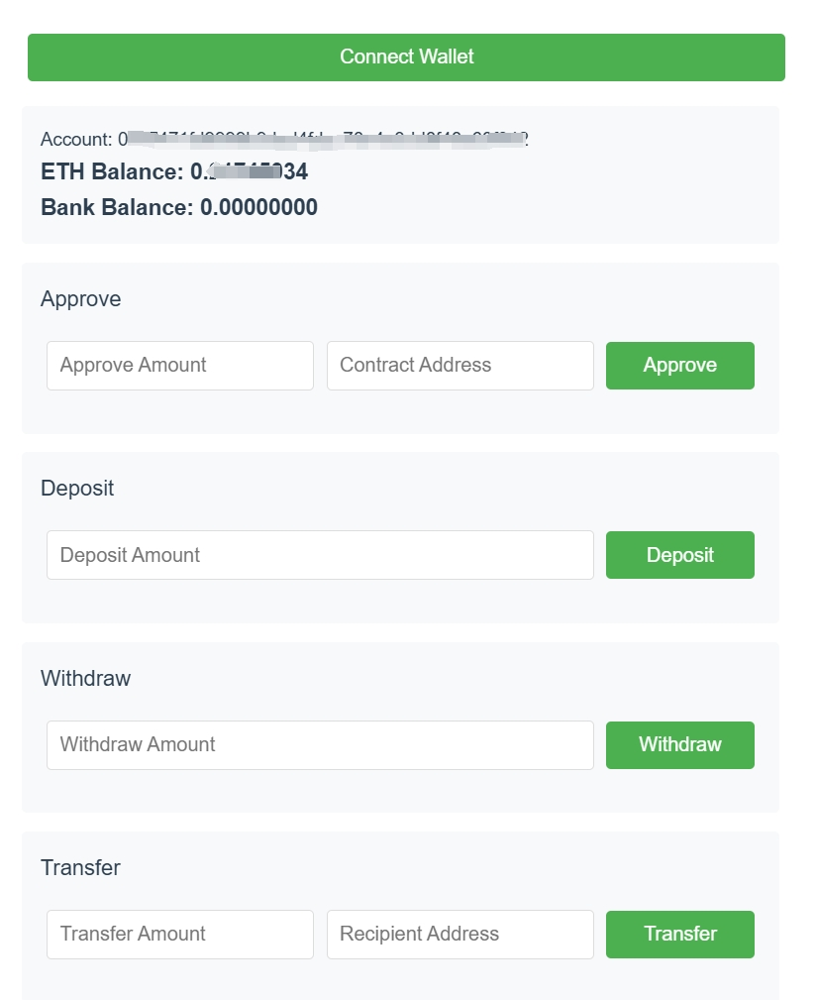

# 银行合约前端应用

## 项目功能

该项目是一个基于Vue.js和Ethereum的银行合约交互Demo。用户可以通过MetaMask连接到以太坊网络，查看和管理银行合约中的代币余额， 运行时界面如下图所示。

<div style="text-align:center"></div>

1. **钱包连接**
   - 通过MetaMask连接以太坊钱包
   - 显示当前账户地址和ETH余额

2. **代币操作**
   - 显示银行合约中的代币余额
   - 存款功能：将代币存入银行合约
   - 取款功能：从银行合约取出代币
   - 转账功能：将代币转账给其他账户
   - 授权功能：授权银行合约操作代币

3. **数值处理**
   - 自动处理18位小数(wei单位转换)
   - 余额显示保留8位小数


## 合约部署
## 智能合约详细说明

### Bank.sol
- 功能：实现银行核心业务逻辑，包括存款、取款、转账和查询余额
- 依赖：需要导入Token.sol作为代币合约
- 主要方法：
  - deposit(uint256 amount): 存入代币
  - withdraw(uint256 amount): 取出代币
  - transfer(address to, uint256 amount): 转账代币
  - getBalance(): 查询余额

### Token.sol
- 功能：实现ERC20标准代币合约
- 特点：
  - 代币名称：构造函数中自己填入（例如 BankDemoToken）
  - 代币符号：构造函数中自行填入（例如 BDT）
  - 小数位数：18
  - 初始供应量：10,000 BDT

### 合约依赖关系
- Bank.sol通过import "./Token.sol"导入Token合约
- Bank合约在构造函数中需要传入Token合约地址
- 所有代币操作都通过Token合约的transferFrom/transfer方法实现
- 部署合约通过 [Remix Ethereum IDE](https://remix.ethereum.org/) 完成，如果需要verify请部署flatened版本的合约
- 部署合约的ABI保存在 `/contracts` 文件夹下的`token.abi.json`和`bank.abi.json`中
- 合约地址保存在`.env`中的BANK_CONTRACT_ADDRESS ，VUE_APP_TOKEN_CONTRACT_ADDRESS

## 项目操作

### 环境准备
1. 安装Node.js (推荐v16+)
2. 安装MetaMask浏览器扩展
3. 配置MetaMask连接到正确的网络

### 安装依赖
```bash
cd bank_web
npm install
```

### 开发模式运行
```bash
npm run dev
```
### 浏览器中查看
在浏览器中打开 （例如 http://localhost:5173/） ，如果MetaMask未连接，会提示连接MetaMask。


